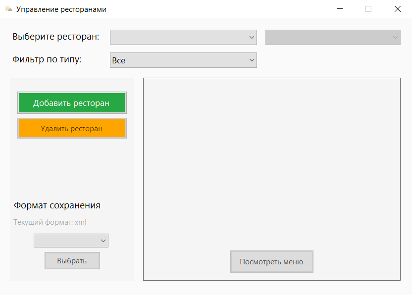

# RestaurantMenu
Десктопное приложение на C#, предназначенное для управления заведениями общепита (ресторанами, кафе, кофейнями). Пользователь может создавать заведения, добавлять к ним меню с блюдами и напитками, а затем сохранять данные в файл в выбранном формате (JSON или XML). Приложение обеспечивает удобный интерфейс для редактирования и хранения информации, что упрощает ведение меню и его экспорт для дальнейшего использования.

# Главное меню
Главное меню предоставляет возможность создать и удалить заведение, посмотреть существующие заведения, применив соответствующие фильтры, посмотреть информацию о заведении, открыть Основное и Сезонное меню в новом окне, выбрать формат сохранения данных.

  

## Добавление заведения

Для добавления заведения необходимо нажать на зеленую кнопку "Добавить ресторан", после чего в открывшимся окне выбрать тип и нажать кнопку "Выбрать".

  
  

В открывшемся окне необходимо заполнить все поля для соответствующего заведения. Для разных типов заведений поля будут различаться.

  
  

Если все поля заполнены верно, появится сообщение об успешном создании заведения. Если в данных будет ошибка - появится соответствующее окно, после закрытия которого можно исправить данные.

  
  

## Просмотр заведений

После создания ресторана в главном меню при выборе в выпадающем списке появится информация о ресторане, возможность посмотреть Основное и Сезонное меню (второй выпадающий список).

  
  

## Удаление заведения

Для удаления заведения необходимо выбрать нужное заведение, нажать на желтую кнопку Удалить ресторан и подтвердить свой выбор в открывшемся окне.

  

## Фильтрация заведений

Если добавить несколько типов заведений, можно фильтровать все доступные заведения по типу. Для этого нужно в соответствующем выпадающем списке выбрать тип заведения. После этого в основном выпадающем списке выбора заведения появятся только эти заведения.

  
  

