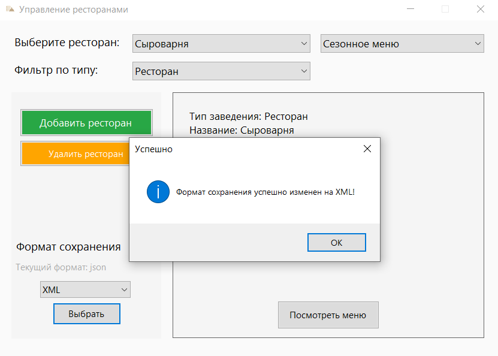
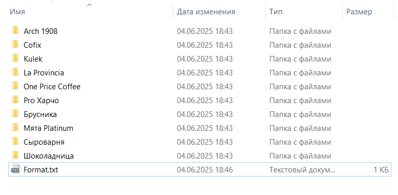

# RestaurantMenu
Десктопное приложение на C#, предназначенное для управления заведениями общепита (ресторанами, кафе, кофейнями). Пользователь может создавать заведения, добавлять к ним меню с блюдами и напитками, а затем сохранять данные в файл в выбранном формате (JSON или XML). Приложение обеспечивает удобный интерфейс для редактирования и хранения информации, что упрощает ведение меню и его экспорт для дальнейшего использования.

## Главное меню

Главное меню предоставляет возможность создать и удалить заведение, посмотреть существующие заведения, применив соответствующие фильтры, посмотреть информацию о заведении, открыть Основное и Сезонное меню в новом окне, выбрать формат сохранения данных.

  

## Добавление заведения

Для добавления заведения необходимо нажать на зеленую кнопку "Добавить ресторан", после чего в открывшимся окне выбрать тип и нажать кнопку "Выбрать".

  
  

В открывшемся окне необходимо заполнить все поля для соответствующего заведения. Для разных типов заведений поля будут различаться.

  
  

Если все поля заполнены верно, появится сообщение об успешном создании заведения. Если в данных будет ошибка - появится соответствующее окно, после закрытия которого можно исправить данные.

  
  

## Просмотр заведений

После создания ресторана в главном меню при выборе в выпадающем списке появится информация о ресторане, возможность посмотреть Основное и Сезонное меню (второй выпадающий список).

  
  

## Удаление заведения

Для удаления заведения необходимо выбрать нужное заведение, нажать на желтую кнопку Удалить ресторан и подтвердить свой выбор в открывшемся окне.

  

## Фильтрация заведений

Если добавить несколько типов заведений, можно фильтровать все доступные заведения по типу. Для этого нужно в соответствующем выпадающем списке выбрать тип заведения. После этого в основном выпадающем списке выбора заведения появятся только эти заведения.

  
  

## Формат сохранения

В левом нижнем углу можно выбрать тип файла, в котором будут сохранятся данные. Для этого нужно выбрать формат из выпадающего списка и нажать кнопку Выбрать. После этого появится сообщение об успешном изменении формата.

  
  

## Добавление позиции меню

После выбора заведения, выбора типа меню (например, Основное) и нажатии кнопки Посмотреть меню в новом окне откроется соответствующее меню заведения.

  

Для добавления нового блюда в меню необходимо нажать кнопку Добавить блюдо, после чего в открывшемся окне выбрать тип блюда и нажать кнопку Выбрать.

  
  

В открывшемся окне необходимо заполнить все поля для соответствующего блюда. Для разных типов блюд поля будут различаться.

  
  

Если все поля заполнены верно, появится сообщение об успешном создании блюда. Если в данных будет ошибка - появится соответствующее окно, после закрытия которого можно исправить данные.

  
  

## Просмотр блюд

После добавления всех блюд они отобразятся в меню автоматически. Можно открыть окно на весь экран для удобства.

  

## Фильтрация блюд

Для просмотра дополнительной информации о каждом блюде их можно отфильтровать по типу. Для этого необходимо выбрать тип блюда в выпадающем списке.

  
  

Каждую таблицу с блюдами можно сортировать, нажимая на заголовки нужных колонок.

## Удаление блюда

Для удаления блюда необходимо выбрать его и нажать кнопку Удалить в последнем столбце таблицы. Для применения изменений ОБЯЗАТЕЛЬНО нужно нажать кнопку Сохранить в верхнем правом углу. После этого появится сообщение об успешном сохранении, а блюдо исчезнет из таблицы.

  
  

## Хранение данных

Все данные хранятся в папке Документы в подпапке RestaurantFiles. У каждого ресторана есть своя папка.

  
  

Для каждого заведения хранится файл типа "Сыроварня_restaurant", где содержится информация о заведении, файл "Сыроварня_main_menu", где хранится информация о блюдах Основного меню и файл "Сыроварня_season_menu", где хранится информация о блюдах сезонного меню.

Файлы json и xml для информации о ресторане:

  
  

Файлы json и xml для информации о меню (Основном):

  
  

